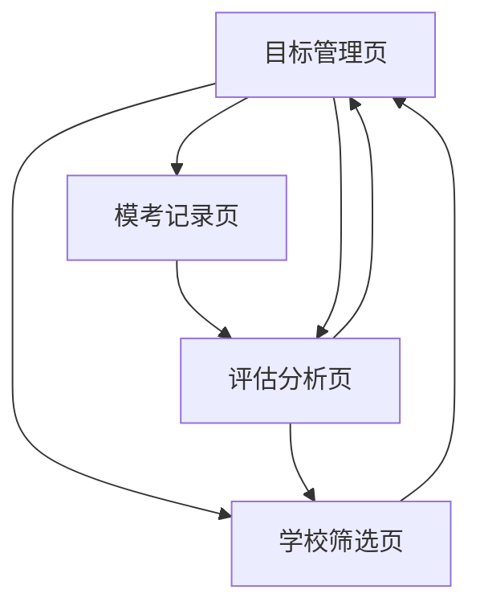

# 上海中考择校系统需求与设计文档

## 1. 产品概览

上海中考择校系统是一款专为上海中考学生和家长设计的智能择校辅助工具，通过数据分析和AI算法，帮助用户科学规划升学路径，提高志愿填报的准确性和成功率。

- **核心价值**：整合上海高中招生政策、学校数据和学生成绩信息，提供个性化的择校推荐和录取概率分析。
- **目标用户**：上海中考学生及其家长，初中教师和升学顾问。
- **产品定位**：专业、智能、易用的升学规划工具，成为上海中考家庭的必备参考。

## 2. 核心功能

### 2.1 功能模块

我们的上海中考择校系统包含以下核心页面：

1. **目标管理页**：目标学校跟踪与管理、学生画像（个人信息与成绩设置）
2. **学校筛选页**：基于条件筛选高中学校
3. **模考记录页**：模考成绩管理与分析
4. **评估分析页**：录取概率评估与分析

### 2.2 页面详情

| 页面名称   | 模块名称     | 功能描述                                                     |
| ---------- | ------------ | ------------------------------------------------------------ |
| 目标管理页 | 目标学校列表 | 展示用户添加的目标学校，包含学校基本信息、录取概率和名额情况 |
| 目标管理页 | 志愿录取说明 | 提供上海中考志愿填报和录取方式的详细说明                     |
| 目标管理页 | 个人信息设置 | 设置所在区、初中类型、当前初中学校等基本信息                 |
| 目标管理页 | 成绩预估设置 | 设置稳定分、上限分、下限分等成绩预估信息                     |
| 学校筛选页 | 学校类型筛选 | 根据学校类型（市重点、区重点、一般高中）筛选学校             |
| 学校筛选页 | 学校列表展示 | 展示符合条件的学校，包含基本信息和录取数据                   |
| 模考记录页 | 模考成绩管理 | 添加、编辑、删除模考成绩记录                                 |
| 模考记录页 | 成绩统计分析 | 统计模考总分、平均分、最高分、最低分等数据                   |
| 评估分析页 | 录取概率评估 | 基于模考成绩分析达到目标学校分数线的概率                     |
| 评估分析页 | 概率可视化   | 使用图表和指标展示录取概率和风险等级                         |

## 3. Core Process

### 用户主要操作流程

1. **初始化设置**：
   - 用户进入系统，首先在目标管理页填写个人基本信息和成绩预估
   - 系统根据用户所在区和初中学校，加载相关高中学校数据

2. **学校筛选与目标设置**：
   - 用户在学校筛选页浏览和筛选高中学校
   - 对感兴趣的学校，添加到目标管理页进行跟踪

3. **模考记录与分析**：
   - 用户在模考记录页添加每次模考的成绩
   - 系统自动计算模考总分和统计数据

4. **目标达成评估**：
   - 系统基于模考成绩和学校分数线，计算录取概率
   - 用户在评估分析页查看各目标学校的达成可能性
   - 根据评估结果，调整目标学校和学习计划



## 4. 用户接口设计

### 4.1 设计风格

- **设计系统**：shadcn/ui + Mira风格
- **基础配置**：base: radix, style: mira, baseColor: neutral, theme: neutral
- **视觉元素**：iconLibrary: lucide, font: inter, radius: default
- **菜单设置**：menuAccent: subtle, menuColor: default
- **主色调**：采用中性色系作为基础，象征专业和信任
- **辅助色**：使用绿色表示高概率，黄色表示中概率，红色表示低概率
- **按钮样式**：圆角矩形按钮，带有轻微的阴影和过渡效果
- **字体**：Inter无衬线字体，确保清晰易读
- **布局风格**：卡片式布局，模块化设计，确保信息层次清晰
- **图标风格**：Lucide线性图标，简洁现代

### 4.2 页面设计概览

| 页面名称 | 模块名称 | UI元素 |
|---------|---------|-------|
| 目标管理页 | 目标学校列表 | 卡片式布局，每个学校卡片包含学校名称、类型、分数线、录取概率、名额情况等信息，使用颜色编码表示概率等级 |
| 目标管理页 | 志愿录取说明 | 信息卡片，包含详细的文字说明和流程图 |
| 目标管理页 | 个人信息设置 | 表单布局，包含下拉选择框和输入框，使用标签和提示文本增强用户体验 |
| 目标管理页 | 成绩预估设置 | 数值输入框，带有上下调整按钮，实时显示输入值 |
| 学校筛选页 | 学校类型筛选 | 下拉选择框和筛选按钮，带有筛选状态指示 |
| 学校筛选页 | 学校列表展示 | 列表式布局，每行会展示学校名称、类型、所在区、分数线等关键信息 |
| 模考记录页 | 模考成绩管理 | 表格布局，支持添加、编辑、删除操作，带有浮动添加按钮 |
| 模考记录页 | 成绩统计分析 | 卡片式布局，展示统计数据和图表 |
| 评估分析页 | 录取概率评估 | 进度条和百分比显示，使用颜色编码表示概率等级 |
| 评估分析页 | 概率可视化 | 柱状图或雷达图，展示各学校的录取概率对比 |

### 4.3 自适应

- **设计理念**：采用移动优先的响应式设计
- **适配设备**：支持桌面端、平板和移动设备
- **布局调整**：在小屏幕设备上，调整为单列布局，优化触控交互
- **字体大小**：根据屏幕尺寸自动调整字体大小，确保可读性
- **触控优化**：增大按钮和交互元素的点击区域，优化触控体验

## 5. 功能规格

### 5.1 目标学校与学生画像管理

- **目标学校管理**：
  - 添加目标学校：从学校列表中选择学校添加到目标列表
  - 删除目标学校：从目标列表中移除学校
  - 清空目标列表：一键清空所有目标学校
  - 目标学校排序：根据录取概率、分数线等因素排序

- **学生画像管理**：
  - 基本信息设置：
    - 所在区：下拉选择上海市各区县
    - 初中类型：选择公办或民办
    - 当前初中学校：根据所在区动态加载初中学校列表
  - 成绩预估设置：
    - 稳定分：学生正常发挥的预估分数
    - 上限分：学生超常发挥的预估分数
    - 下限分：学生失常发挥的预估分数

### 5.2 学校筛选与查询

- **学校类型筛选**：
  - 市重点：市实验性示范性高中
  - 区重点：区实验性示范性高中
  - 一般高中：普通高级中学

- **学校详情查询**：
  - 学校基本信息：名称、代码、所在区、类型
  - 录取分数线：各区县历年分数线
  - 到校名额：对应初中学校的到校名额

### 5.3 模考记录管理

- **添加模考记录**：
  - 模考名称：如一模、二模、校测等
  - 各科成绩：语文、数学、英语、道法、历史、体育
  - 自动计算总分

- **模考数据统计**：
  - 总分统计：每次模考的总分
  - 平均分：所有模考的平均总分
  - 最高分：所有模考的最高总分
  - 最低分：所有模考的最低总分
  - 标准差：成绩稳定性分析

### 5.4 用户认证管理

- **用户注册**：
  - 支持用户名 + 邮箱 + 密码注册
  - 注册成功后自动登录

- **用户登录**：
  - 支持用户名/邮箱 + 密码登录
  - 基于JWT的无状态认证

- **个人中心**：
  - 获取当前用户信息（/auth/me）
  - 登出（清除本地Token）

- **认证安全**：
  - JWT令牌存储在本地（localStorage）
  - 后端统一校验Token有效性

### 5.5 目标达成可能性评估

- **概率计算模型**：
  - 基于正态分布模型计算达到分数线的概率
  - 考虑模考成绩的均值和标准差
  - 考虑学校分数线的历年变化

- **概率等级划分**：
  - 高概率（保）：75%以上
  - 中概率（稳）：40%-75%
  - 低概率（冲）：40%以下

- **评估结果展示**：
  - 百分比概率显示
  - 颜色编码指示
  - 进度条可视化
  - 文字说明和建议

## 6. 技术实现要点

### 6.1 技术栈（当前实现）

- **前端**：Vite + React + TypeScript + React Router + Tailwind CSS + shadcn/ui + react-i18next
- **后端**：Flask + Python（Pydantic用于参数校验）
- **数据库**：PostgreSQL（可接 Supabase）
- **客户端**：Capacitor（iOS 打包）
- **部署**：Flask 同时提供 `/api/v1` 与 `dist/` 静态资源；可选 Vercel Serverless 入口 `api/index.py`

### 6.2 前端实现要点

- **目录结构**：
  - `src/pages/*` 仅做页面组合
  - `src/features/*` 负责业务页面与逻辑
  - `src/components/Shared/*` 为跨页面可复用组件
  - `src/components/ui/*` 为 shadcn/ui 原子组件（默认只读）
- **状态与请求**：
  - React Query 处理请求与缓存
  - `src/lib/api.ts`/`src/lib/dataClient.ts` 作为统一数据访问层
- **认证**：
  - Token 存储在 localStorage（`token`）
  - 请求统一注入认证头

### 6.3 后端实现要点

- **API 分层**：
  - `app/api/v1/*`：路由 + 参数校验 + 响应封装
  - `app/services/*`：业务逻辑与数据组合
  - `app/core/*`：配置、鉴权、数据库适配器
- **响应结构**：
  - 统一 `api_response({data, meta})`，详见 `docs/api/contract.md`
- **认证**：
  - JWT 鉴权 + `require_auth` 中间件

### 6.4 数据模型（现状逻辑层）

- **schools**：`id`, `name`, `code`, `district`, `type`, `fullType`, `accommodation`, `stats`
- **middle_schools**：`id`, `name`, `district`, `type`
- **student_profiles**：`district`, `middle_school_id`, `stable_score`, `high_score`, `low_score`
- **target_schools**：`user_id`, `school_code`
- **mock_exams**：`id`, `name`, `examDate`, `scores`, `totalScore`, `createdAt`

> 注：字段以 API 响应/前端类型为准；数据库具体列以 `app/services/*` 实现为依据。

### 6.5 API 接口设计（/api/v1）

#### 认证相关
- `POST /auth/register`
- `POST /auth/login`
- `POST /auth/logout`
- `GET /auth/me`

#### 学生画像
- `GET /filter/student-profile`
- `POST /filter/student-profile`
- `GET /filter/options`
- `GET /filter/middle-schools`

#### 学校与目标
- `GET /schools/`
- `GET /schools/{id}`
- `GET /schools/simple`
- `GET /schools/targets`
- `POST /schools/targets`
- `DELETE /schools/targets/{school_code}`
- `GET /schools/targets/evaluation`

#### 模考
- `GET /mocks/`
- `POST /mocks/`
- `PUT /mocks/{exam_id}`
- `DELETE /mocks/{exam_id}`
- `GET /mocks/stats`

> 统一响应结构：`{ data, meta }`；错误结构见 `docs/api/contract.md`。

### 6.6 概率计算模型

- **正态分布模型**：
  - 假设学生成绩服从正态分布
  - 使用模考成绩的均值和标准差作为分布参数
  - 计算达到学校分数线的概率

- **计算公式**：
  ```python
  def calculate_probability(mean_score, std_score, threshold_score):
      # 使用正态分布计算概率
      z_score = (threshold_score - mean_score) / std_score
      probability = 1 - norm.cdf(z_score)
      return max(0, min(1, probability))
  ```

- **参数调整**：
  - 考虑考试难度调整
  - 考虑分数线的历年变化趋势
  - 考虑不同学校的竞争激烈程度

## 7. 面向AI的约束规则

### 7.1 数据隐私保护

- **敏感数据处理**：
  - 学生个人信息加密存储
  - 成绩数据脱敏处理
  - 遵循数据最小化原则

- **隐私政策**：
  - 明确告知用户数据收集和使用方式
  - 获得用户明确授权
  - 提供数据删除和导出功能

### 7.2 算法透明度

- **模型解释**：
  - 清晰说明概率计算模型的原理
  - 提供模型参数的调整说明
  - 解释评估结果的含义和局限性

- **结果展示**：
  - 展示原始数据和计算过程
  - 提供多种评估角度
  - 避免过度简化或误导性展示

### 7.3 系统稳定性

- **错误处理**：
  - 完善的错误处理机制
  - 友好的错误提示
  - 系统故障恢复能力

- **性能保障**：
  - 优化算法性能，确保快速响应
  - 实现请求限流和负载均衡
  - 定期系统维护和监控

### 7.4 数据质量

- **数据验证**：
  - 输入数据的有效性验证
  - 数据一致性检查
  - 异常数据处理

- **数据更新**：
  - 定期更新学校和分数线数据
  - 确保数据的时效性和准确性
  - 提供数据版本控制

### 7.5 用户体验

- **易用性**：
  - 直观的用户界面
  - 简化的操作流程
  - 详细的使用指南和帮助信息

- **个性化**：
  - 基于用户数据提供个性化推荐
  - 记忆用户偏好设置
  - 适应不同用户的使用习惯

## 8. 部署与集成方案

### 8.1 部署架构

- **前端部署**：
  - 使用 Vite 构建，产物输出到 `dist/`
  - 由 Flask 同时提供静态资源与 API
  - 可选独立部署静态资源（CDN/对象存储）

- **后端部署**：
  - Flask 作为 API 服务（`/api/v1`）
  - 本地入口：`app/main.py`
  - 可选 Vercel Serverless 入口：`api/index.py`

- **数据库部署**：
  - PostgreSQL 为主数据库
  - 可选 Supabase 托管的 PostgreSQL

### 8.2 集成方案

- **客户端集成**：
  - Web：Vite + React
  - iOS：Capacitor 打包（`capacitor.config.ts`）

- **API集成**：
  - 统一 `/api/v1` 路由与标准响应结构
  - 详细契约见 `docs/api/contract.md`

### 8.3 监控与维护

- **日志与错误**：
  - 前后端分别记录关键请求与错误信息
  - 统一错误结构便于排查

- **维护计划**：
  - 以迭代方式更新学校数据与逻辑
  - 版本变更同步更新文档与契约

## 9. 项目管理与开发计划

### 9.1 开发阶段

- **阶段一：基础架构搭建**（2周）
  - 前端项目初始化和组件库搭建
  - 后端API框架搭建
  - 数据库设计和初始化

- **阶段二：核心功能开发**（4周）
  - 学生信息管理功能
  - 学校数据管理和查询
  - 目标学校管理功能
  - 模考记录管理功能

- **阶段三：评估系统开发**（3周）
  - 概率计算模型实现
  - 评估结果展示
  - 数据可视化功能

- **阶段四：优化与测试**（2周）
  - 性能优化
  - 兼容性测试
  - 用户体验优化
  - 安全测试

- **阶段五：部署与上线**（1周）
  - 系统部署
  - 数据迁移
  - 上线前检查
  - 正式上线

### 9.2 团队分工

- **前端开发**：2人
  - 负责前端界面开发
  - 实现用户交互功能
  - 优化前端性能和用户体验

- **后端开发**：2人
  - 负责后端API开发
  - 实现数据处理和计算模型
  - 数据库设计和优化

- **数据分析师**：1人
  - 负责数据收集和处理
  - 优化概率计算模型
  - 提供数据分析支持

- **测试工程师**：1人
  - 负责系统测试
  - 编写测试用例
  - 确保系统质量

- **产品经理**：1人
  - 负责产品规划和需求管理
  - 协调团队工作
  - 与用户沟通和反馈收集

## 10. 结论与建议

上海中考择校系统是一款结合了数据科学和教育领域专业知识的智能工具，通过科学的数据分析和AI算法，为上海中考学生和家长提供个性化的择校推荐和录取概率分析，帮助用户做出更加明智的升学决策。

### 建议

1. **持续更新数据**：定期更新学校数据、分数线数据和招生政策，确保系统信息的准确性和时效性。

2. **优化算法模型**：不断优化录取概率计算模型，考虑更多因素，提高预测准确性。

3. **丰富功能模块**：根据用户反馈，逐步添加更多实用功能，如志愿填报指导、学习计划推荐等。

4. **加强用户教育**：提供更多关于中考政策、学校选择和志愿填报的教育内容，帮助用户更好地理解和使用系统。

5. **建立社区互动**：建立用户社区，促进家长和学生之间的经验分享和交流。

通过不断的迭代和优化，上海中考择校系统将成为上海中考家庭的重要工具，帮助更多学生实现理想的升学目标。
