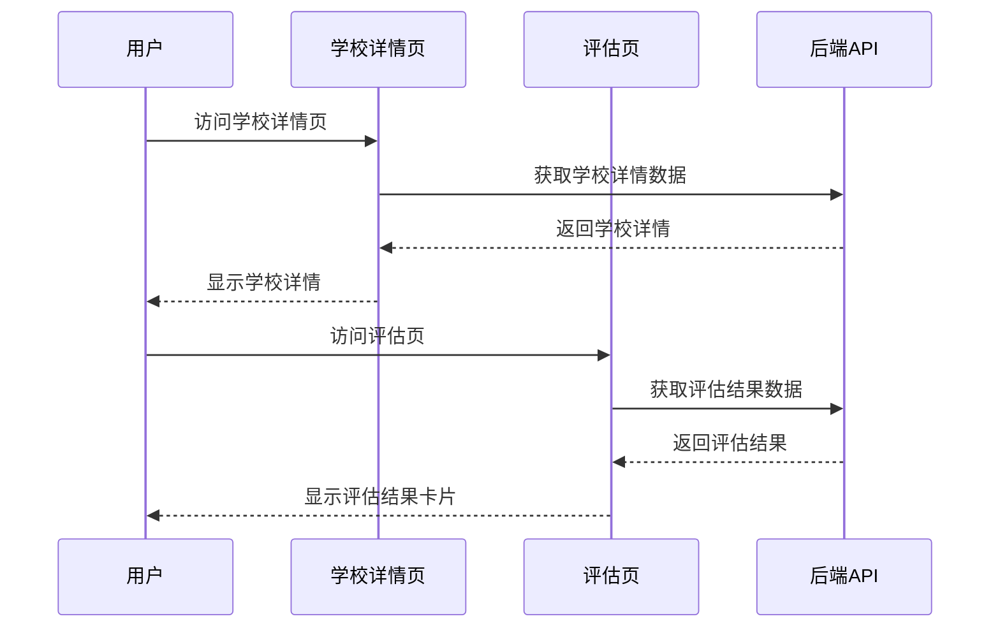
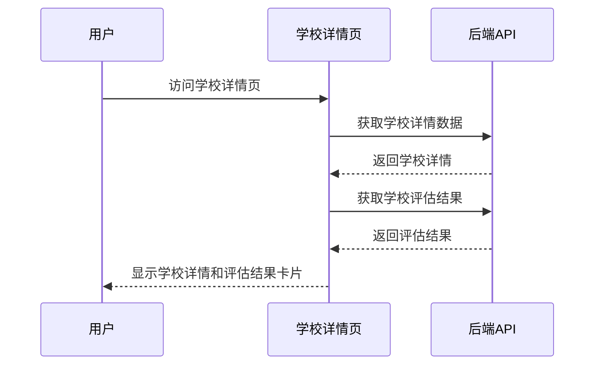

# 需求变更文档：学校详情模块 v1.3

## 1. 变更概览

- **模块名称**：学校详情
- **变更版本**：v1.3
- **变更日期**：2026-02-03
- **变更类型**：功能新增

## 2. 变更需求

### 2.1 需求列表

| 序号 | 需求描述                                                                                   | 优先级 |
| ---- | ------------------------------------------------------------------------------------------ | ------ |
| 1    | 在学校详情页，单独加一个对于这个学校的评估结果卡片，卡片内容跟"评估页"中的内容完全保持一致 | 高     |

### 2.2 需求背景

为了让用户在查看学校详情时能够同时了解该学校的评估结果，避免用户在不同页面之间切换，提高用户体验。

## 3. 现状分析

### 3.1 现有功能

- **学校详情页**：包含学校介绍、招生信息、分数线信息和学校概况等模块
  - 学校介绍：显示学校基本信息和特色
  - 招生信息：显示学校招生计划和名额分配
  - 分数线信息：显示学校近年来的录取分数线
  - 学校概况：显示学校与学生的匹配情况

- **评估页**：包含目标学校的评估结果卡片
  - 显示各招生渠道（自招、到区、到校、统一）的分数、名额、差距和状态
  - 支持单模考和多模考两种情况的不同显示
  - 提供状态图标（🟢、🟡、🔴）直观展示录取可能性

### 3.2 现有代码结构

- **前端**：
  - `src/features/schools/SchoolDetailPage.tsx`：学校详情页主组件
  - `src/features/eval/components/EvalTargetCard.tsx`：评估结果卡片组件
  - `src/lib/dataClient.ts`：API调用封装
  - `src/lib/types.ts`：数据类型定义

- **后端**：
  - `app/api/v1/schools.py`：学校相关API
  - `app/services/schools_service.py`：学校业务逻辑

### 3.3 现状流程图



## 4. 变更方案

### 4.1 前端变更

1. **在学校详情页中引入评估结果卡片组件**
   - 复用现有的 `EvalTargetCard` 组件
   - 添加获取单个学校评估结果的API调用

2. **调整页面布局**
   - 在学校概况模块之后添加评估结果卡片
   - 保持页面整体风格一致

3. **状态管理**
   - 使用React Query管理评估结果数据的缓存和加载状态
   - 处理评估结果的加载和错误状态

### 4.2 后端变更

1. **新增API接口**
   - 新增 `/schools/{schoolId}/evaluation` 接口
   - 返回单个学校的评估结果，格式与现有评估接口一致

2. **数据处理**
   - 复用现有的评估逻辑，针对单个学校进行评估
   - 确保评估结果与评估页中的计算逻辑一致

### 4.3 变更后流程图



### 4.4 现状与修改方案对比

| 模块         | 现状                                         | 修改方案                                 | 影响范围              |
| ------------ | -------------------------------------------- | ---------------------------------------- | --------------------- |
| 学校详情页   | 包含学校介绍、招生信息、分数线信息和学校概况 | 添加评估结果卡片，显示与评估页一致的内容 | 前端页面布局和API调用 |
| 评估结果卡片 | 仅在评估页中显示                             | 同时在学校详情页中显示                   | 组件复用              |
| 后端API      | 提供批量评估结果接口                         | 新增单个学校评估结果接口                 | 后端路由和业务逻辑    |
| 数据模型     | 现有数据模型满足需求                         | 无需修改数据模型                         | 无影响                |


## 5. 技术设计

### 5.1 前端设计

#### 5.1.1 组件复用
- **复用 `EvalTargetCard` 组件**：直接使用评估页中现有的评估结果卡片组件
- **组件适配**：确保组件能够在学校详情页中正常显示，保持与评估页一致的样式和功能

#### 5.1.2 API调用
- **新增API函数**：在 `dataClient.ts` 中添加 `getSchoolEvaluation` 函数
- **API路径**：`/schools/{schoolId}/evaluation`
- **数据类型**：使用现有的 `TargetEvaluationResponse` 类型

#### 5.1.3 状态管理
- **使用React Query**：添加新的查询键 `['schools:evaluation', schoolId]`
- **加载状态**：添加评估结果的加载状态处理
- **错误状态**：添加评估结果的错误状态处理
- **缓存策略**：与其他API调用保持一致的缓存策略

#### 5.1.4 布局调整
- **位置**：在学校概况模块之后添加评估结果卡片
- **样式**：保持与页面其他模块一致的间距和样式
- **响应式**：确保在不同屏幕尺寸下正常显示

### 5.2 后端设计

#### 5.2.1 API设计
- **路由**：`GET /schools/{schoolId}/evaluation`
- **参数**：
  - `schoolId`：学校ID（路径参数）
- **响应**：
  - 成功：`200 OK`，返回单个学校的评估结果
  - 失败：`404 Not Found`，如果学校不存在
  - 失败：`500 Internal Server Error`，如果评估过程中出现错误

#### 5.2.2 数据处理
- **复用评估逻辑**：使用现有的评估服务逻辑
- **单学校评估**：针对指定的单个学校进行评估
- **数据格式**：返回与批量评估接口一致的数据格式

#### 5.2.3 性能考虑
- **缓存**：考虑对评估结果进行缓存，减少重复计算
- **异步处理**：对于复杂的评估计算，考虑使用异步处理

### 5.3 数据结构

#### 5.3.1 前端数据结构
```typescript
// 评估结果响应类型
interface TargetEvaluationResponse {
  profile: TargetEvaluationProfile;
  model: TargetEvaluationModel;
  targets: TargetEvaluationSchool[];
}

// 学校评估结果类型
interface TargetEvaluationSchool {
  id: string;
  name: string;
  district: District;
  type: HighSchoolType;
  fullType?: string;
  channels: {
    autonomous: TargetEvaluationChannel;
    district: TargetEvaluationChannel;
    school: TargetEvaluationChannel;
    unified: TargetEvaluationChannel;
  };
  overall: {
    level: 'high' | 'mid' | 'low' | 'na';
  };
}
```

#### 5.3.2 后端数据结构
- **输入**：学校ID
- **输出**：与前端 `TargetEvaluationResponse` 对应的后端数据结构
- **中间数据**：学生档案、模考成绩、学校分数线等

## 6. 实现计划

### 6.1 前端实现

#### 6.1.1 步骤1：添加API调用函数
- **文件**：`src/lib/dataClient.ts`
- **修改**：添加 `getSchoolEvaluation` 函数
- **内容**：
  ```typescript
  export async function getSchoolEvaluation(schoolId: string): Promise<ApiResponse<TargetEvaluationResponse>> {
    return fallback(
      () => fetcher.get(`/schools/${encodeURIComponent(schoolId)}/evaluation`),
      () => Promise.resolve({
        data: {
          profile: {
            district: null,
            middleSchoolId: null,
            stableScore: null,
            highScore: null,
            lowScore: null,
          },
          model: { mean: null, std: null, count: 0, source: 'none' },
          targets: [],
        },
      })
    );
  }
  ```

#### 6.1.2 步骤2：修改学校详情页组件
- **文件**：`src/features/schools/SchoolDetailPage.tsx`
- **修改**：
  1. 导入 `EvalTargetCard` 组件
  2. 导入 `getSchoolEvaluation` 函数
  3. 添加评估结果查询
  4. 在页面中添加评估结果卡片
- **内容**：
  ```typescript
  // 导入组件和函数
  import EvalTargetCard from '@/features/eval/components/EvalTargetCard';
  import { getSchoolEvaluation } from '@/lib/dataClient';
  
  // 添加评估结果查询
  const { data: evalResp } = useQuery({
    queryKey: ['schools:evaluation', id],
    queryFn: () => getSchoolEvaluation(id || ''),
    enabled: !!id,
  });
  
  // 提取评估结果
  const evaluation = evalResp?.data ?? null;
  const model = evaluation?.model ?? { mean: null, std: null, count: 0, source: 'none' };
  const evalSchool = evaluation?.targets?.[0] ?? null;
  
  // 在页面中添加评估结果卡片
  {evalSchool && (
    <EvalTargetCard
      school={evalSchool}
      model={model}
      t={t}
    />
  )}
  ```

#### 6.1.3 步骤3：调整页面布局和样式
- **文件**：`src/features/schools/SchoolDetailPage.tsx`
- **修改**：确保评估结果卡片与页面其他模块保持一致的间距和样式

### 6.2 后端实现

#### 6.2.1 步骤1：添加API接口
- **文件**：`app/api/v1/schools.py`
- **修改**：添加新的路由和处理函数
- **内容**：
  ```python
  @router.get("/{school_id}/evaluation", response_model=ApiResponse[TargetEvaluationResponse])
  async def get_school_evaluation(
      school_id: str,
      db: Session = Depends(get_db),
      current_user: User = Depends(get_current_user),
  ):
      """获取单个学校的评估结果"""
      try:
          evaluation = await schools_service.evaluate_single_school(
              db=db,
              user_id=current_user.id,
              school_id=school_id,
          )
          return {"data": evaluation}
      except SchoolNotFoundError:
          raise HTTPException(status_code=404, detail="School not found")
      except Exception as e:
          logger.error(f"Error evaluating school: {e}")
          raise HTTPException(status_code=500, detail="Internal server error")
  ```

#### 6.2.2 步骤2：实现单学校评估逻辑
- **文件**：`app/services/schools_service.py`
- **修改**：添加 `evaluate_single_school` 函数
- **内容**：
  ```python
  async def evaluate_single_school(
      db: Session,
      user_id: UUID,
      school_id: str,
  ) -> TargetEvaluationResponse:
      """评估单个学校"""
      # 获取学生档案
      profile = await get_student_profile(db, user_id)
      
      # 获取学校信息
      school = await get_school_by_id(db, school_id)
      if not school:
          raise SchoolNotFoundError()
      
      # 获取模考成绩
      mock_exams = await get_user_mock_exams(db, user_id)
      
      # 计算评估模型
      model = calculate_evaluation_model(mock_exams)
      
      # 评估学校
      evaluated_school = await evaluate_school(school, profile, model)
      
      # 构建响应
      return TargetEvaluationResponse(
          profile=profile,
          model=model,
          targets=[evaluated_school],
      )
  ```

#### 6.2.3 步骤3：测试和验证
- **测试**：确保API接口能够正常返回评估结果
- **验证**：确保评估结果与评估页中的内容一致
- **性能**：确保API响应时间合理

## 7. 测试计划

- **功能测试**：验证评估结果卡片在学校详情页中正确显示
- **数据一致性测试**：验证评估结果与评估页中的内容一致
- **布局测试**：验证页面布局和样式在不同屏幕尺寸下的适配
- **状态测试**：验证评估结果的加载状态和错误状态处理
- **性能测试**：验证添加评估结果卡片后页面加载速度是否受到影响

## 8. 风险评估

- **API依赖**：如果后端API未就绪，可能需要使用mock数据
- **数据一致性**：需要确保评估结果与评估页中的计算逻辑一致
- **性能影响**：添加额外的API调用可能会影响页面加载速度
- **兼容性**：需要确保在不同浏览器和设备上的兼容性

## 9. 影响范围

- **前端**：
  - 修改 `src/features/schools/SchoolDetailPage.tsx`：添加评估结果卡片
  - 修改 `src/lib/dataClient.ts`：添加获取单个学校评估结果的函数
- **后端**：
  - 修改 `app/api/v1/schools.py`：添加新的API接口
  - 修改 `app/services/schools_service.py`：添加单学校评估逻辑
- **其他**：不影响其他页面功能和数据模型

## 10. UI组件修改方案

### 10.1 组件导入和使用

- **导入组件**：在 `SchoolDetailPage.tsx` 中导入 `EvalTargetCard` 组件
- **导入函数**：在 `SchoolDetailPage.tsx` 中导入 `getSchoolEvaluation` 函数
- **导入类型**：确保导入必要的类型定义

### 10.2 布局调整

- **位置**：在学校概况模块之后添加评估结果卡片
- **间距**：保持与页面其他模块一致的间距（使用 `space-y-4` 类）
- **容器**：使用与其他模块相同的容器类

### 10.3 状态处理

- **加载状态**：在评估结果加载过程中显示加载指示器
- **错误状态**：在评估结果获取失败时显示错误信息
- **空状态**：在评估结果为空时显示提示信息

### 10.4 响应式设计

- **桌面端**：完整显示评估结果卡片的所有列
- **平板端**：保持完整显示，可能需要调整列宽
- **移动端**：确保表格内容能够横向滚动，或者在小屏幕上自动调整布局

### 10.5 视觉一致性

- **颜色**：使用与评估页相同的颜色方案
- **字体**：使用与页面其他模块相同的字体和字号
- **图标**：使用与评估页相同的状态图标（🟢、🟡、🔴）
- **边框**：使用与页面其他模块相同的边框样式

### 10.6 具体实现示例

```typescript
// 修改后的 SchoolDetailPage.tsx 部分代码
import EvalTargetCard from '@/features/eval/components/EvalTargetCard';
import { getSchoolEvaluation } from '@/lib/dataClient';
import { useTranslation } from 'react-i18next';

// 在组件中添加
const { t } = useTranslation();

// 添加评估结果查询
const { data: evalResp, isLoading: isEvalLoading, error: evalError } = useQuery({
  queryKey: ['schools:evaluation', id],
  queryFn: () => getSchoolEvaluation(id || ''),
  enabled: !!id,
});

// 提取评估结果
const evaluation = evalResp?.data ?? null;
const model = evaluation?.model ?? { mean: null, std: null, count: 0, source: 'none' };
const evalSchool = evaluation?.targets?.[0] ?? null;

// 在页面中添加评估结果卡片
<StateContainer className="pt-[env(safe-area-inset-top)] pb-[env(safe-area-inset-bottom)] space-y-4">
  <SchoolIntroductionSection school={school} />
  <SchoolEnrollmentSection enrollment={school.enrollment} />
  <SchoolScoresSection scores={school.scores} year={school.enrollment?.year ?? null} />
  <SchoolProfileSection
    district={studentProfile?.district}
    middleSchoolName={middleSchoolName}
    stableScore={studentProfile?.stable_score}
    highScore={studentProfile?.high_score}
    lowScore={studentProfile?.low_score}
    recommendedSchool={recommendedSchool}
  />
  
  {/* 评估结果卡片 */}
  {isEvalLoading ? (
    <div className="p-4 bg-card rounded-lg border border-border">
      <div className="flex justify-center items-center h-20">
        <div className="text-muted-foreground">{t('ui.loading')}...</div>
      </div>
    </div>
  ) : evalError ? (
    <div className="p-4 bg-card rounded-lg border border-border">
      <div className="text-destructive text-center">{t('ui.error.loadFailed')}</div>
    </div>
  ) : evalSchool ? (
    <EvalTargetCard
      school={evalSchool}
      model={model}
      t={t}
    />
  ) : (
    <div className="p-4 bg-card rounded-lg border border-border">
      <div className="text-muted-foreground text-center">{t('ui.eval.hint.noEvaluation')}</div>
    </div>
  )}
</StateContainer>
```

### 10.7 API接口设计

#### 10.7.1 接口路径
- `GET /schools/{schoolId}/evaluation`

#### 10.7.2 请求参数
| 参数名     | 类型   | 位置 | 描述   |
| ---------- | ------ | ---- | ------ |
| `schoolId` | string | 路径 | 学校ID |

#### 10.7.3 响应格式

```json
{
  "data": {
    "profile": {
      "district": "黄浦",
      "middleSchoolId": "123",
      "stableScore": 680,
      "highScore": 700,
      "lowScore": 660
    },
    "model": {
      "mean": 680,
      "std": 15,
      "count": 3,
      "source": "mocks"
    },
    "targets": [
      {
        "id": "123",
        "name": "上海中学",
        "district": "徐汇",
        "type": "市重点",
        "channels": {
          "autonomous": {
            "score": 700,
            "quota": 50,
            "gap": 20,
            "status": "green"
          },
          "district": {
            "score": 690,
            "quota": 30,
            "gap": 10,
            "status": "green"
          },
          "school": {
            "score": 685,
            "quota": 20,
            "gap": 5,
            "status": "yellow"
          },
          "unified": {
            "score": 680,
            "quota": 100,
            "gap": 0,
            "status": "yellow"
          }
        },
        "overall": {
          "level": "high"
        }
      }
    ]
  }
}
```

#### 10.7.4 错误响应

- **404 Not Found**：
  ```json
  {
    "detail": "School not found"
  }
  ```

- **500 Internal Server Error**：
  ```json
  {
    "detail": "Internal server error"
  }
  ```
